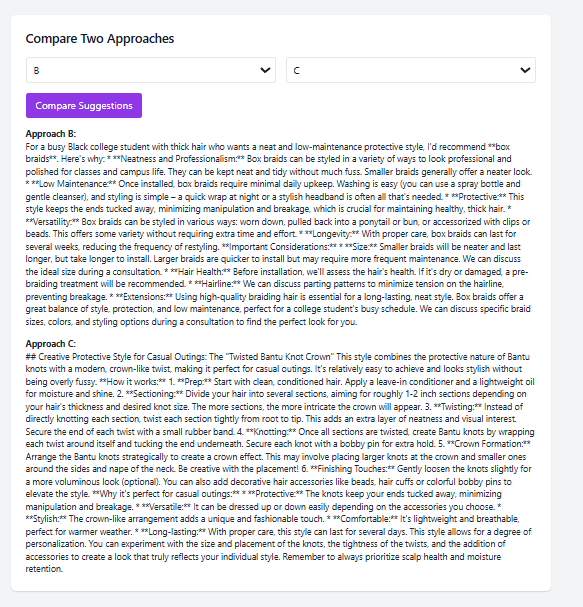
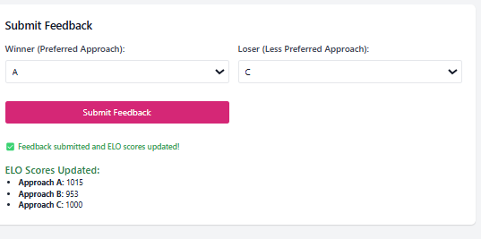
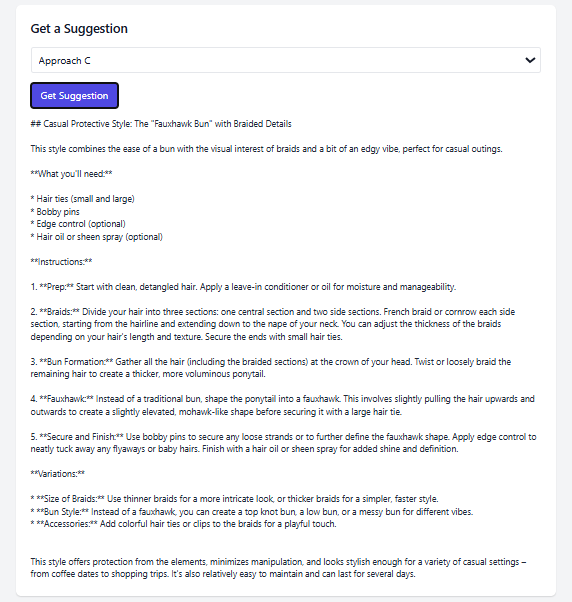

# Milestone 6: Evaluating GenAI Outputs

## Objective

This milestone implements a minimal infrastructure to evaluate and compare outputs from different GenAI prompting approaches in a practical web interface. It supports:

- Generating hairstyle recommendations using multiple prompt strategies
- Comparing outputs side-by-side
- Submitting user feedback to dynamically update ELO scores

---

## Features Implemented

### 1. Multiple Prompting Approaches
We implemented **three distinct GenAI approaches**:

- **Approach A** – Professional styles for corporate settings  
- **Approach B** – Neat styles for Black college students  
- **Approach C** – Creative casual hairstyles for outings

The backend dynamically selects the prompt and queries the Gemini API based on the selected approach.

### 2. Compare GenAI Outputs
Users can compare any two approaches via a clean UI. The interface displays both responses side-by-side for visual evaluation.

### 3. Submit Feedback with ELO Scoring
Users select the preferred and less-preferred approach. ELO scores are updated immediately, and the new ratings are displayed live on the page.

---

##  Technical Details

- **Backend**: Laravel PHP (routes in `web.php`, controller in `GenAIController.php`)
- **Frontend**: Tailwind CSS, Select2, and vanilla JavaScript
- **GenAI API**: Google Gemini (v1beta via REST)
- **Scoring System**: ELO rating algorithm, persisted in `elo_scores.json`

## How to Use

1. Visit `/genai` in your Laravel app.
2. Select an approach and click **Get Suggestion**.
3. Compare two approaches using the **Compare** section.
4. Submit feedback — ELO scores will update in real time.

---

## ELO Scoring Logic

- Every approach starts at a base score of `1000`
- When a user selects a winner and loser:
  - The winner’s score increases
  - The loser’s score decreases
- The score difference is based on expected outcome (ELO formula)
- Scores are saved to `elo_scores.json`

---

## Screenshots

### Suggestion UI

### Compare Approaches

### Submit Feedback

---

## Credits

Developed for **Yale University - CPSC 445/545: Advanced Software Engineering**, Spring 2025.
